<p align="center">
  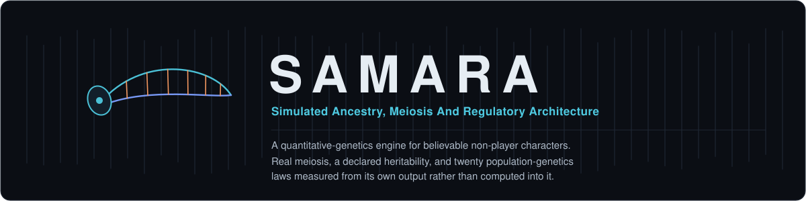
</p>

<p align="center">
  
  
  
  
  
  
</p>

<p align="center">
  <sub>
    <b>505 loci</b> · <b>22 autosomes + XY</b> · <b>42 traits</b> ·
    <b>2000-locus recessive load</b> · <b>8 scenarios</b> ·
    <b>28 dashboard panels</b> · <b>one rigged body per life stage</b>
  </sub>
</p>

<p align="center">
  <b>SAMARA</b> gives simulated characters a real genome. Meiosis instead of
  arithmetic, a heritability you <i>declare</i> and then <i>measure back out</i>,
  and twenty population-genetics laws the engine is required to reproduce from
  its own output. It ships as a Python library, an analysis dashboard, and a
  real-time viewer that draws every character as a rigged body at the age they
  actually are.
</p>

---

## The problem, in one picture

Most game and simulation characters inherit through one of two rules: a
single-gene Mendelian switch per visible trait, or an arithmetic blend of the
parents' trait values. Both are cheap, legible and long established. Neither is
how a genome works, and the consequence is structural rather than cosmetic.

<p align="center">
  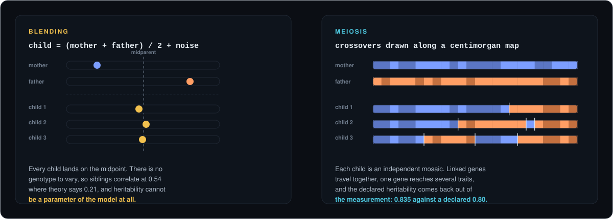
</p>

Under one locus per trait there can be no **pleiotropy**: if eye colour is one
gene and stature another, no mechanism exists by which the two can be
genetically correlated. Under independent assortment there can be no
**linkage**: real chromosomes travel in blocks, and a family's resemblance has a
block structure that independent assortment cannot produce. And under blending,
**heritability cannot be a parameter at all**, because an offspring's expected
value simply *is* its midparent value.

That last one is the serious one, and it is measurable. The predecessor
blending implementation is still in this repository, so the comparison is a
measurement rather than an argument:

| declared *h*² | quantity | meiosis | blending | theory |
|---|---|---:|---:|---:|
| **0.80** stature | midparent-offspring slope | 0.869 | 0.991 | 0.810 |
| | realised *h*² (*R*/*S*) | 0.835 | **1.012** | 0.800 |
| **0.40** neuroticism | midparent-offspring slope | 0.423 | 1.016 | 0.410 |
| | realised *h*² (*R*/*S*) | 0.429 | **1.011** | 0.400 |
| | full-sib correlation | 0.210 | **0.540** | 0.213 |

Blending sits near 1.0 whatever was declared, so its error is not constant: it
*scales with how heritable the trait actually is*. At *h*² = 0.80 it overstates
the response to selection by about a quarter. At *h*² = 0.40 it overstates it by
a factor of 2.5, and a moderately heritable trait is exactly where the damage is
done.

> The conventional objection to blending, that it collapses variance across
> generations, is wrong. The simulated-binary-crossover operator's beta
> distribution is engineered to conserve spread, and measured against the
> retained implementation, it does. The real failure is elsewhere, and it is
> worse.

---

## What SAMARA replaces it with

Individuals carry a diploid genome of **505 biallelic loci across 22 autosomes
and a sex pair**. Meiosis draws crossovers as a Poisson process along real
centimorgan maps, so linked genes co-inherit and the recombination fraction
between two loci is an *emergent* property of their map distance rather than a
parameter. Phenotype is composed as *P = A + D + I + G×E + E*, with variance
components solved per trait against a **declared heritability**, across
**42 traits**.

Everything above that layer, from epigenetics to disease to migration, is
written against the genome rather than against the phenotype.

<p align="center">
  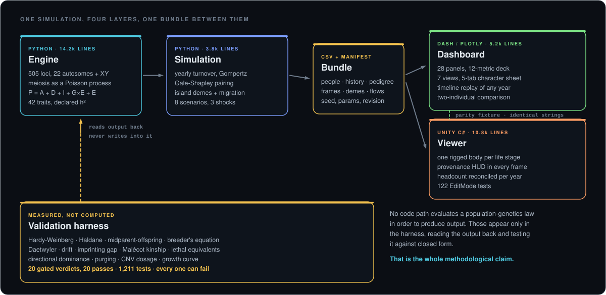
</p>

**The commitment that shapes the whole project: nothing it claims is computed.**
No code path evaluates Hardy-Weinberg or the breeder's equation in order to
*produce* output. Sixteen population-genetics laws are measured from emergent
output and compared against closed-form or published expectations by an
automated harness that returns **20 gated verdicts**. Every one of them could
fail.

---

## The result that explains the project

<p align="center">
  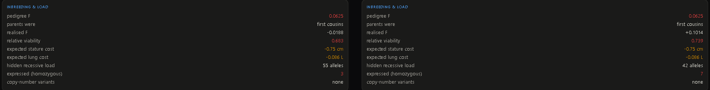
</p>

**Lena (left) and Ada (right) have the same two parents.** Their pedigree
inbreeding coefficient is therefore the same number, 0.0625, and so are the two
costs derived from it: −0.75 cm of stature and −0.086 L of lung capacity.

Their *realised* inbreeding is not the same number: **−0.0188 against +0.1014**.
One sister received a genome less homozygous than a random outbred draw; the
other received one substantially more homozygous than her pedigree predicted.

And the subtler half: Lena is the **less** homozygous sister and the **less**
viable one, 0.683 against 0.739, although she exposes three load alleles where
Ada exposes seven. Viability follows *which* alleles a genome happened to
expose and what their selection coefficients are, not how many.

Nothing here was implemented. A model that transmits phenotypes cannot produce
it, because it has no meiosis for the variance to arise in. It is two adjacent
numbers on one tab of a character sheet, and it is the entire argument.

---

## See it

<p align="center">
  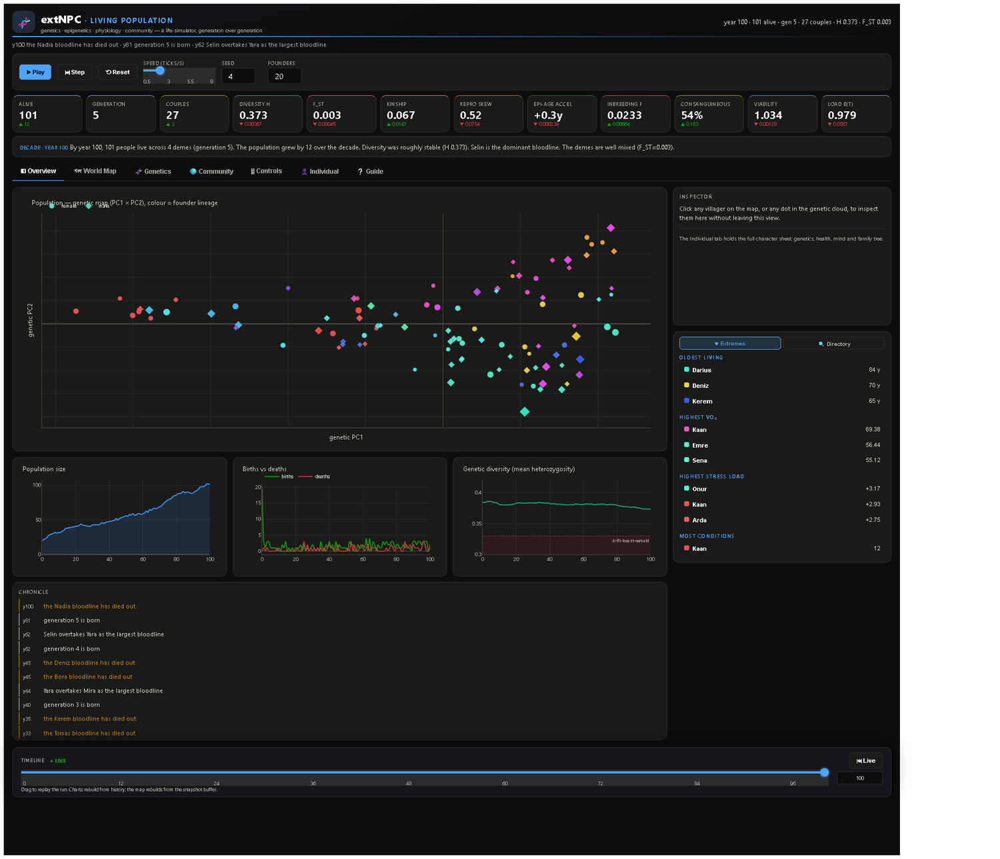
</p>

<sub>Year 100 of a closed four-deme village. Along the top: the run controls,
the twelve-metric deck with each tile's ten-year trend, and an automatically
written decade summary. Below the tab bar: the genetic map, in which every
living villager is placed by the first two principal components of their own
genome and tinted by dominant founder ancestry.</sub>

<table>
<tr>
<td width="50%">

**World map.** Four settlements on their terrain, every villager in place,
tinted by dominant founder ancestry. Migration routes thicken with use and
decay when unused. Settlement membership, size and the routes between them are
emergent, not authored.

</td>
<td width="50%">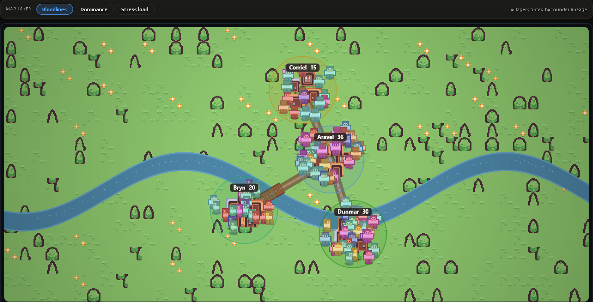</td>
</tr>
<tr>
<td>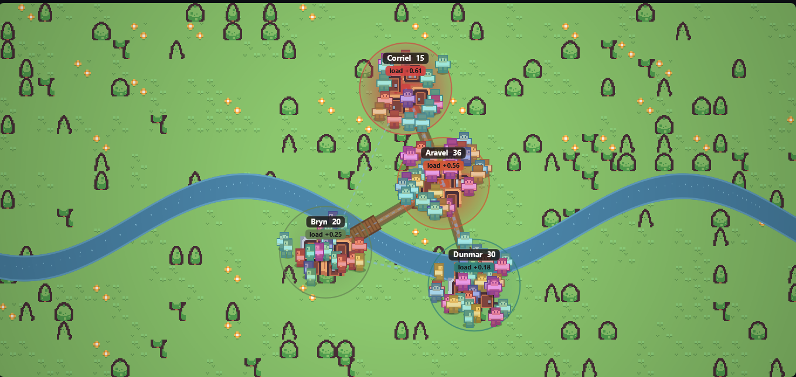</td>
<td>

**Three interchangeable layers** over the same map: bloodline, ancestry
dominance, and mean allostatic load per territory. Stress is a physiological
quantity carried by individuals, aggregated here by where they live.

</td>
</tr>
<tr>
<td>

**Genetics** is the laboratory tab: trait evolution over time, the allele
frequency spectrum, heterozygosity distributions, the imprinting gap, the
X-linked sex ratio, mitochondrial haplogroups, de novo mutation counts and the
epigenetic-age cloud.

</td>
<td>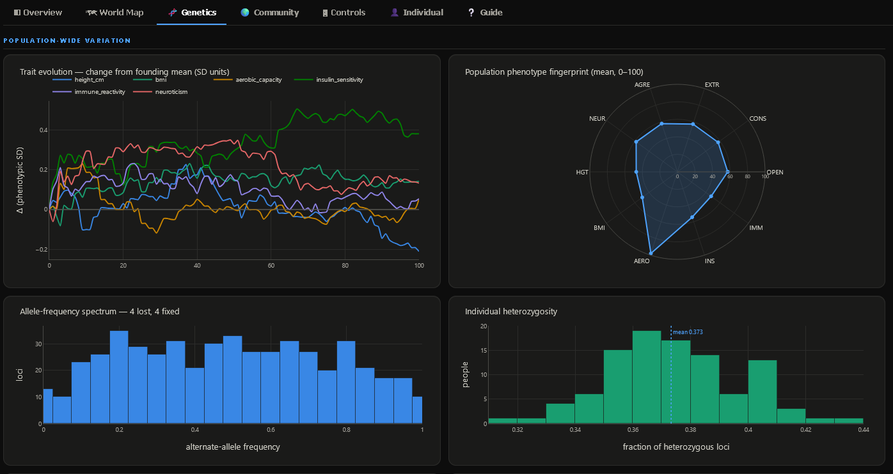</td>
</tr>
<tr>
<td>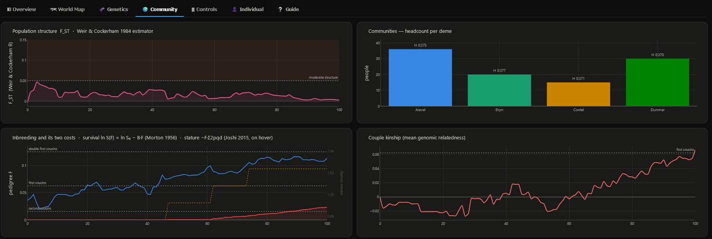</td>
<td>

**Community** carries the population-structure argument: *F*<sub>ST</sub>
against its island-model expectation, deme composition, the kinship
distribution, and the two costs of inbreeding plotted *separately* against the
same *F*, because they are two mechanisms and not two views of one.

</td>
</tr>
<tr>
<td>

**Any villager opens** from the map or from a dot in the genetic cloud, into a
five-tab character sheet: identity, genome, a dated medical history,
personality and physiological state, and a family tree with consanguineous
unions marked.

</td>
<td>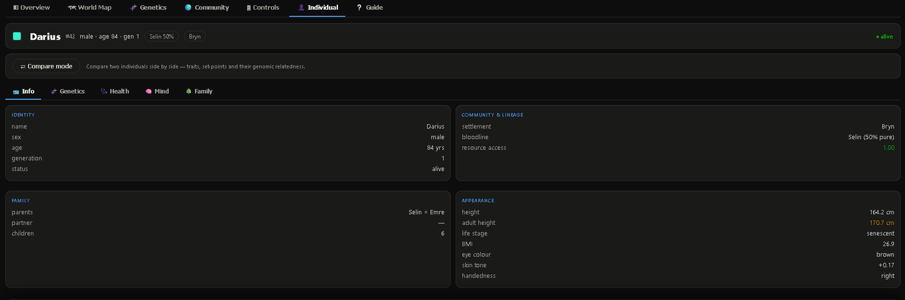</td>
</tr>
<tr>
<td>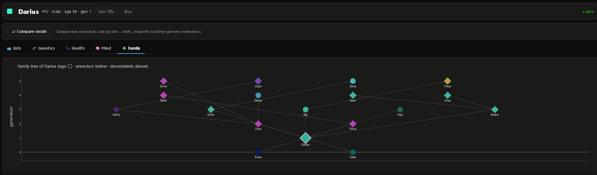</td>
<td>

**The family tree** is drawn from the pedigree the simulation actually built.
By year 100 of a closed four-deme village, 54.5% of the living have parents who
are second cousins or closer, and nothing in the parameter set asked for it.

</td>
</tr>
<tr>
<td>

**Controls** exposes every run parameter, grouped into three labelled bands,
plus eight scenario presets (isolated islands, melting pot, founder crash,
Malthusian squeeze, harsh and unequal) and three one-off shocks: plague,
famine, bottleneck.

</td>
<td>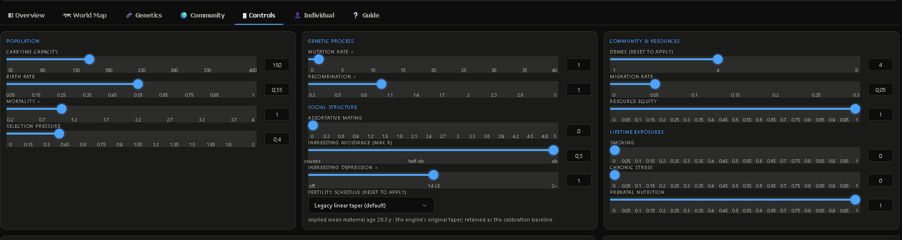</td>
</tr>
<tr>
<td>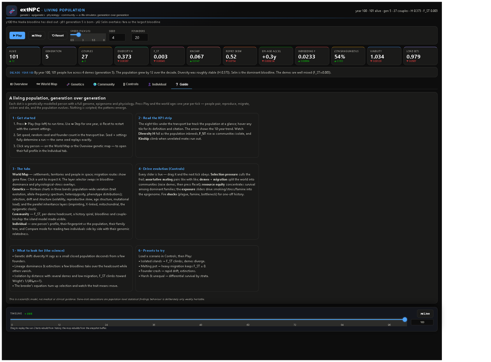</td>
<td>

**A Guide tab that teaches.** It states what each panel measures, what would
count as a surprising value, and which parts of the model are deliberately
weak. A simulation that shows you an *F*<sub>ST</sub> of 0.003 without saying
what a large one would have been is not being read, it is being believed.

</td>
</tr>
</table>

### The real-time viewer

<p align="center">
  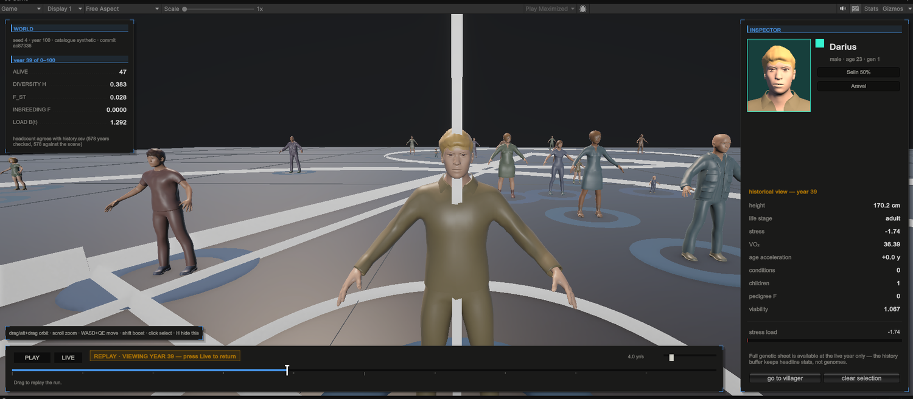
</p>

The same exported world, rendered. Note the HUD: **seed, year, catalogue mode
and source revision travel into the runtime**, so a screenshot is traceable to
the code that produced it. The viewer also reconciles its on-screen headcount
against the exported history table for every replayed year (*"headcount agrees
with history.csv, 578 years checked"*).

<p align="center">
  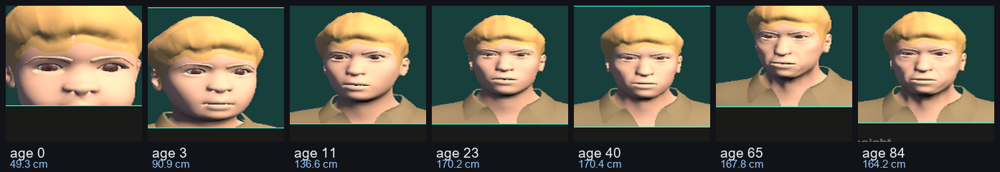
</p>

**One genome, seven bodies.** The same individual at seven points in one
century: 49.3 cm at age 0, then 90.9 at 3, 136.6 at 11, 170.2 at 23, 170.4 at
40, 167.8 at 65, 164.2 at 84. The mature genetic endpoint is 171 cm throughout
and never changes. What moves is the developmental factor applied to it: a
Preece-Baines growth trajectory followed by modelled senescent loss. Faces are
baked from that individual's own genome.

---

## Nothing it claims is computed

| Law | Checked against | Source |
|---|---|---|
| Hardy-Weinberg proportions | genotype frequencies under random mating | Hardy 1908; Weinberg 1908 |
| Haldane's map function | recombination fraction vs map distance, 40 locus pairs | Haldane 1919 |
| Midparent-offspring regression | slope ≈ *h*² per trait | Falconer & Mackay 1996 |
| Breeder's equation | selection response ≈ *h*² × *S* | Lush 1937 |
| Daetwyler's law | PGS accuracy vs training *N* and marker count | Daetwyler et al. 2008 |
| Allele-frequency drift | variance vs 2*N*<sub>e</sub> expectation | Wright 1931 |
| X-linked epidemiology | colour blindness at *q* in males, *q*² in females | Lyon 1961 |
| mtDNA bottleneck | offspring heteroplasmy variance = *h*(1−*h*)/*N*<sub>e</sub> | Wallace 1999 |
| Reciprocal-heterozygote gap | imprinted parent-of-origin effect = 2·*s*·*a* | DeChiara et al. 1991 |
| Cryptic-variation release | Var(*z*) = *k*²·V<sub>gen</sub> + V<sub>env</sub> past threshold | Waddington 1942 |
| Wright's *F*<sub>ST</sub> | between-deme differentiation vs migration | Wright 1931; Weir & Cockerham 1984 |
| Lethal equivalents | ln *S*(*F*) = ln *S*₀ − *B*·*F*, *B* recovered by regression | Morton, Crow & Muller 1956 |
| Directional dominance | *M*<sub>F</sub> − *M*₀ = −*F*·Σ2*pq d*; −1.2 cm per 10% *F* | Joshi et al. 2015 |
| Malécot kinship | pedigree coefficients to machine precision | Malécot 1948; Wright 1922 |
| CNV dosage response | shift = (copies/2 − 1)·ΣE[val]; deletion and duplication mirror | Jacquemont et al. 2011 |
| Growth curve | fraction of adult stature vs age, rms 0.0014 | Preece & Baines 1978; Tanner 1962 |

**20 gated verdicts, 20 passes.** Three further sections (Haldane's map
function, polygenic-score accuracy, and the demonstration that *h*² is a
property of a population *in an environment*) are reported **without** a pass
criterion, because a threshold on them would encode an arbitrary tolerance
rather than a law, and that distinction is stated rather than blurred.

### It tracks its own parameters, not just has them

One run shows the engine can simulate a village. It does not show that its
behaviour is a *function* of the parameters it exposes. Two shipped scenarios
differ essentially in one number:

| Scenario | *m*/yr | *m*<sub>gen</sub> | measured *F*<sub>ST</sub> | island-model prediction |
|---|---:|---:|---:|---:|
| isolated islands | 0.005 | 0.145 | **0.0848** | 0.1022 |
| baseline run | 0.050 | 0.799 | **0.0028** | 0.0069 |
| melting pot | 0.150 | 0.994 | **0.0019** | 0.0139 |

Three seeds per arm, 100 years. Every isolated-islands seed (0.051, 0.080,
0.124) exceeds every melting-pot seed (−0.000, 0.001, 0.005), with **no
overlap**, and the arm means differ by a factor of 44 from a 30-fold difference
in the parameter.

> [!WARNING]
> **A units trap worth knowing about.** Wright's *m* is **per generation**;
> `DemographyParams.migration_rate` is an **annual** per-individual probability.
> Substituting one for the other understates 4*N*<sub>e</sub>*m* by ~29x here
> and makes a correct model look badly wrong. The conversion is
> *m*<sub>gen</sub> = 1 − (1 − *m*)<sup>*T*</sup>, and *T* is not a parameter of
> this model. It falls out of the mortality schedule, the fertility window and
> the matching, so it is **measured**: 31.3 years.

### The invariant that holds it together

Every layer added after the foundation either draws from its **own** RNG or
draws strictly **after** all autosomal draws. In a stochastic simulator the RNG
stream is effectively a global variable: inserting one `rng.uniform()` upstream
shifts every downstream draw and silently decalibrates the model. Append-only
draws plus private generators is the discipline that prevents it.

**Two strengths of that claim, and the difference matters.** The tail-draw
layers, sex chromosomes and mitochondria, consume from the *caller's*
generator, so their invariant is **per-individual, not per-sequence**: founder
#0 is byte-identical, founder #1 onward is not. The recessive-load and
copy-number layers carry no such caveat: they draw from a **spawned
sub-generator**, because `numpy.random.Generator.spawn` advances the parent's
*seed sequence* while leaving its bit-generator state alone. All 175
pre-existing tests passed unchanged when those two layers landed, with no
expected value touched.

A thesis methods section should say "per individual", and this one does.

### Two surfaces, one set of numbers

The dashboard and the real-time viewer read the same exported bundle, and they
are held to identical output **mechanically rather than by discipline**: the
Python inspector is run over a fixed world and its formatted strings are
written out as a generated C# fixture, which the Unity EditMode suite then has
to reproduce, under two locales.

That pair has already caught what neither a code review nor a working scene
would have. Python rounds half-to-even while .NET rounds half-away-from-zero,
so an eighth of ancestry rendered `13%` in Unity against `12%` in the
dashboard.

---

## Quick start

```bash
uv sync                                    # the exact locked graph, 49 packages

uv run python run_dashboard.py             # the live population sim at :8050
uv run python health_engine_prototype.py   # engine demo + harness + figures
uv run python -m pytest tests/ -q          # the suite, ~8 min: the rigorous gate
uv run python export_for_unity.py          # write a world bundle for the viewer
```

<details>
<summary>Using pip instead</summary>

```bash
python -m pip install -r requirements.txt
python -m pytest tests/ -q
```

This works and gets you the same eight direct versions. It does **not** get
you the same stack: `requirements.txt` pins what this project imports
directly, and a working environment holds 63 packages, so the other 55 float.
`uv.lock` pins all 49 resolved packages with hashes, which is what a
reproducibility claim should actually rest on. `tools/check_repo.py` fails if
the two files ever disagree about a version.

</details>

Python **3.14** is what the suite is verified against, and `requires-python`
in `pyproject.toml` is the single place that says so. Versions are pinned
exactly rather than with `>=`, because the project's central claim is that a
seeded run is reproducible and numpy has changed RNG behaviour across minor
versions before.

The demo drives the **engine** on a hand-built nine-person pedigree. The
**simulation layer** and its dashboard are separate: that is `run_dashboard.py`.

### What one simulated year does

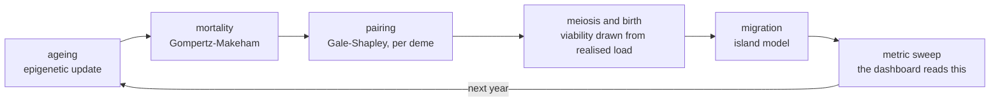

The order is part of the model rather than an implementation detail, because it
decides whether a person who dies this year could have had a child this year.

<details>
<summary><strong>Empirical allele frequencies (experimental)</strong></summary>

```bash
EXTNPC_CATALOGUE=empirical python run_dashboard.py
```

Swaps 21 core genes' hand-set allele frequencies for measured 1000 Genomes
phase 3 EUR values, vendored with provenance in `health_engine/data/`. The
default is byte-identical to every committed figure and pinned by test. The two
modes are different model versions: world saves record which one they were made
under and refuse to load across the boundary.

> **Experimental, and the failures are the finding.** Full suite under the
> flag: 6 failed / 574 passed. Real EUR frequencies change the *shape* of the
> genotypic distribution, flipping `eye_color`'s kurtosis from −0.771 to
> +0.978, and redistribute variance sharply for traits whose variance sits in a
> few loci: SLC24A5 keeps its −1.80 weight and loses 98.7% of its variance
> contribution, because at *q* = 0.997 there is nearly nothing left to vary.
> Tests asserting the synthetic architecture's shape then fail *correctly*.
> Widening a tolerance would hide exactly the result. See the KNOWN FAILURES
> block in `health_engine/loci.py`.

```bash
python -m health_engine.catalogue_compare   # synthetic vs EUR, side by side
```

</details>

<details>
<summary><strong>Running the real-time viewer</strong></summary>

```bash
python export_for_unity.py --years 90 --founders 16 --demes 3 --migration 0.08
```

That writes a plain-file bundle: `manifest.json`, `people.csv`, `history.csv`,
`pedigree.csv`, `frames.csv`, `demes.csv`, `flows.csv`, `events.csv` and
`diseases.csv`. Add `unity/com.samal.extnpc` to a Unity 6 project, point
`ExtNpcWorldLoader` at the folder, and press play.

**It is a viewer, and the distinction is enforced rather than promised:** it
performs no biology, draws no random numbers, and derives no phenotype. If a
number reaches the screen, there is a CSV cell it was read from.
`tests/test_unity_contract.py` reads the C# source as text and asserts every
column it requests exists in a real export.

**Why files and not a live socket.** Measured on this machine: engine import
12.4 s, tick cost ~1.7 ms per living person per year, so a 600-person village
runs near a second per simulated year. That is a batch job, not something to
animate against. Exporting once and viewing many times removes the engine from
the interactive loop entirely, which is what makes the viewer smooth: the
architecture, not the renderer.

</details>

> [!NOTE]
> On Windows, two dev servers can both bind `:8050` and a stale process will
> silently serve old code. Kill every `:8050` listener before relaunching.

---

## What it models

| | |
|---|---|
| **Genome** | 22 autosomes with real centimorgan maps; meiosis draws crossovers as a Poisson process, so linked genes co-inherit |
| **Loci** | 505 biallelic loci, 55 named GWAS genes plus a 450-locus peripheral background, feeding a sparse gene × trait weight matrix, so EDAR touches hair, teeth, ears, chin and sweat glands at once |
| **Phenotype** | *P* = additive + dominance + epistasis + G×E + environment, with variance components solved per trait to hit a target heritability, across 42 traits |
| **Discrete traits** | Liability-threshold traits (Falconer 1965), not single-gene switches; expression is deterministic given the genome |
| **Epigenetics** | Lifetime-dynamic methylation with an epigenetic clock, and a germline firewall that resets ~95% of marks between generations |
| **Regulation** | A sparse gene to gene trans layer over 8 real TF hubs, so knocking out RUNX2 shifts traits it has no direct weight on |
| **Sex** | X/Y determination, hemizygosity, random X-inactivation (Lyon 1961), sex-limited expression |
| **Mitochondria** | Strict maternal transmission, heteroplasmy, an OXPHOS threshold, and the *N*<sub>e</sub> = 30 bottleneck |
| **Imprinting** | Parent-of-origin silencing at IGF2, so reciprocal heterozygotes with the same genotype and the opposite parent differ by exactly 2·*s*·*a* |
| **Inbreeding** | One *F*, two independent consequences: survival via a 2000-locus recessive load at *B* = 1.4 lethal equivalents, and stature via directional dominance calibrated to Joshi et al. 2015 |
| **Disease** | Nine real autosomal recessive disorders labelled onto load loci; incidence follows *P* = *q*² + *Fpq* exactly |
| **Development** | A Preece-Baines growth trajectory applied to the *output* of the genotype to phenotype path, so the calibrated path never sees an age |
| **Structural variation** | Deletions and duplications scaling a locus's genotypic deviation, at mutation-selection balance |
| **Physiology** | A state vector on a sub-daily clock: glucose, sleep pressure, a four-stage HPA cascade, monoamine tones and allostatic load, with ten heritable gains |

### The body-to-mind layer, and why the engine exists

`physiology.py` produces the state the host framework was built to consume, and
exposes two read-outs for it: an interoceptive salience list, and a probability
distribution over eight action classes.

The second is measurable, so it is measured. Holding the body and the hour
fixed and changing **only** the internal state, a hungry high-cortisol state and
a sated calm one produce action distributions **1.69 nats apart** in
Kullback-Leibler divergence. `forage` carries 0.631 of the mass in the first
and 0.042 in the second, while `explore` runs the other way, 0.078 against
0.501. The same state renders to a sentence, so a language model can be handed
`[body] ravenous; highly stressed; thirsty` rather than a vector.

**Nothing consumes those read-outs yet, and that is the honest position of the
whole project.** Whether an agent conditioned on a genuinely inherited body
behaves differently from one conditioned on an arbitrary one is open, and it is
the question the architecture was chosen to make askable. The predecessor
blending implementation is retained in the repository, so the control arm is a
different *inheritance rule over an identical world* rather than a different
system.

---

## Layout

```
health_engine/        the engine: everything below is per-individual genetics
  genetic_map.py        22 autosomes, physical (Mb) and genetic (cM) maps
  loci.py               55 named GWAS genes + 450 peripheral SNPs
  genome.py             diploid genome, meiosis with crossover, mutation
  traits.py             genotype -> phenotype: A + D + I + GxE + E
  npc.py                the individual: genome + persistent deviates + life
  epigenome.py          lifetime-dynamic methylation, clock, germline firewall
  grn.py                gene-regulatory / omnigenic network
  sexchrom.py           X-linked, X-inactivation, sex-limited inheritance
  mito.py               maternal inheritance, heteroplasmy, bottleneck
  imprint.py            genomic imprinting: parent-of-origin silencing
  canalize.py           developmental buffering, cryptic variation release
  inbreeding.py         Malecot F, the load spectrum, directional dominance
  cnv.py                copy-number variation and dosage response
  development.py        Preece-Baines growth, senescent decline
  asymmetry.py          fluctuating asymmetry: what development failed to control
  physiology.py         physiological state vector, hormones, action bias
  diseases.py           nine autosomal recessive disorders on the load loci
  medical.py            acquired, non-heritable conditions
  legacy.py             v0.2 operators (SBX, n-point crossover), kept as a control
  validation.py         the harness: HWE, Haldane, h^2, breeder's, PGS, ...
  viz.py                figures

simulation/           the simulation layer: many individuals over time
  world.py              yearly turnover: birth, pairing, ageing, death
  demography.py         Gompertz-Makeham mortality, fertility, Gale-Shapley matching
  community.py          Wright island model: demes, migration, F_ST
  pedigree.py           pedigree graph + Malecot kinship
  lineage.py            founder-ancestry lineage colours
  events.py             eight scenario presets; plague, famine, bottleneck
  chronicle.py          narrates notable events; the metric glossary + citations
  export.py             the world bundle: CSV tables + a provenance manifest
  worldsave.py          full world save and restore
  snapshots.py          per-tick ring buffer, the timeline scrubber's feed

dashboard/            Dash/Plotly analysis deck: 7 views, 28 panels, 12 metrics
  panels.py             the charts and the metric deck
  inspector.py          the character sheet; the parity source for the viewer
  genetics_panels.py    the laboratory tab
  export_job.py         simulate, export, and optionally bake bodies
  session_sync.py       selection and year, shared with the viewer

unity/                UPM package: reads a bundle, renders the village
  Runtime/Data/         RFC-4180 CSV reader, locale-proof parsing, manifest
  Runtime/View/         villagers, deme rings, orbit camera, timeline, inspector
  Tests/                122 EditMode tests, incl. a generated parity fixture

mpfb/                 the genome -> parametric mesh -> rigged body bake path
tests/                the Python suite, 1,211 tests
outputs/              validation figures, regenerated by the demo
docs/brand/           the diagrams above, from docs/make_diagrams.py
docs/showcase/        the screenshots above, from docs/make_showcase.py
```

---

## Known limitations

Kept deliberately visible, per the project's scientific-honesty standard. This
list is a feature, not an apology.

- **Believability is asserted, not measured.** No human participant has
  evaluated the output and no believability instrument has been administered.
  Every result here is *internal* validity: the engine is shown to obey the
  laws it claims to obey.
- **Sexual dimorphism in stature is −0.57 cm** against a real human value near
  13 cm, and lean mass fraction carries the same uncalibrated gap deliberately,
  because fixing one and not the other would leave a reader with a pair they
  cannot audit.
- **Pubertal timing has the right sign and the wrong magnitude**, 1.3 years
  between the sexes against Tanner's roughly 2.0, most likely because the fit
  targets median cross-sectional stature and smears the spurt across
  individuals of differing tempo.
- **PGS do not transfer across ancestries.** Allele frequencies here are
  neutral placeholders, not ancestry-specific; nothing in this model licenses
  cross-population comparison.
- **Candidate-gene to behaviour links are contested.** COMT/MAOA/5-HTTLPR-style
  single-SNP behavioural switches largely failed to replicate (Border et al.
  2019). Genetic variation here sets only modest polygenic priors on hormone
  and receptor-sensitivity parameters.
- **The omnigenic core/peripheral split is an engineering device**, not settled
  biology; Wray et al. 2018 argue it understates real complexity.
- **Resource stratification is a stylized family-wealth proxy** by lineage
  headcount. It is not an economic model and emphatically not a gene-for-status
  claim.
- **Migration is isolation-by-distance on a static settlement layout**, not a
  stepping-stone lattice; settlements never move or get founded.
- **Only one locus is imprinted.** Humans have ~100-200; the catalogue contains
  exactly one genuinely imprinted gene (IGF2), and adding more would change
  `N_LOCI` and invalidate every calibrated heritability. Imprinting here is
  also whole-body, where real imprinting is tissue- and stage-specific.
- **The canalization capacity is not calibrated against human data**, because
  no such data exists. What is tested is Waddington's *qualitative* claim
  (buffered below threshold, released above) plus internal *k*² consistency.
  Canalization here also cannot evolve.
- **Directional dominance covers two traits, not all of them.** `height_cm` and
  `lung_capacity` are calibrated to Joshi et al. 2015, and four traits Joshi
  found nothing in are deliberately left flat, so the model reproduces the
  paper's nulls as well as its positives. Every *other* trait is
  **uncalibrated in this respect, not calibrated to zero**.
- **The load spectrum's parameters do not evolve.** Realised *B* is measured
  from the living each year and does move, falling 31% over the reported
  century from 1.419 to 0.979, but `SPECTRUM.q`, the founding frequency
  vector, stays where it started.
- **CNVs model dosage, not loss of function.** The magnitude of a dosage effect
  and the mirror symmetry between a deletion and its duplication are exact,
  while the *direction* of a loss-of-function phenotype is not modelled: 15q11
  deletion patients are hypopigmented and the engine gets that sign wrong, for
  exactly this reason.
- **Development varies in endpoint, not in tempo.** Every character travels the
  same normalised growth curve toward its own genetic adult stature, so the
  model cannot produce early and late maturers, and cannot show the variance
  spike that makes adolescent height so dispersed.
- **Neither the suite nor the harness runs in CI.** Both are run by hand, so a
  regression is caught when someone thinks to look rather than at the commit
  that introduces it. For a project whose central claim is reproducibility,
  that is the most conspicuous piece of missing infrastructure.
- **Mating is monogamous and heterosexual by construction**, which is a
  modelling choice with demographic consequences and not a claim about human
  societies.

### Ethics

An engine that models consanguinity and its consequences touches material with
a real-world history of misuse. Three commitments follow. The model is of
**populations**, and its individual-level outputs are fictional characters, not
predictions about people. The disease panel is calibrated to published carrier
frequencies for one named reference population and is **unsuitable for
epidemiological use**, with the cystic fibrosis misfit documented in the code
and the export manifest. And the engine must not be used to infer anything
about real individuals or groups: it maps genotypes to phenotypes under
assumptions it declares, which is the opposite of the inference direction that
DNA phenotyping would require.

---

## Figures

Regenerated by `python health_engine_prototype.py` into `outputs/`.

| File | Shows |
|---|---|
| `recombination_haldane.png` | Simulated recombination fraction vs Haldane's map function |
| `heritability_validation.png` | Midparent-offspring regression vs theoretical *h*² |
| `pleiotropy_matrix.png` | Core gene × trait weight matrix, EDAR outlined |
| `pedigree_relatedness.png` | Realised genomic relatedness (GCTA) across the pedigree |
| `family_ocean_radars.png` | OCEAN profiles, founders dashed vs offspring solid |
| `epigenetics.png` | Smoking to AHRR trajectory, epigenetic clock, germline firewall |
| `physiology.png` | Action distributions by state, HPA axis over a day, EDAR to behaviour |
| `grn_network.png` | RUNX2 knockout syndrome and its downstream program |
| `sex_linked.png` | Colour-blindness *q* vs *q*², G6PD mosaicism, sex-limited alopecia |
| `mito_inheritance.png` | OXPHOS threshold, mtDNA bottleneck vs closed form |
| `imprinting.png` | Reciprocal heterozygotes, the 2·*s*·*a* law, the population effect |
| `canalization.png` | Variance flat while the buffer holds, then released |
| `inbreeding_depression.png` | ln *S* vs pedigree *F* recovering *B*; hidden load exposed |
| `cnv_dosage.png` | Linear mirror-symmetric dosage response; mutation-selection balance |
| `development.png` | Growth to a genetic endpoint; Preece-Baines vs Tanner |

The diagrams and screenshots in this README are rebuilt by
`python docs/make_diagrams.py` and `python docs/make_showcase.py`.

## Assets

Terrain art is Kenney's "Tiny Town" (CC0); see
`dashboard/assets/sprites/tiny_town_LICENSE.txt`. The villager sprite sheet is
authored here and regenerable via `dashboard/assets/sprites/make_villager.py`
(requires Pillow); it is also CC0. Body meshes are baked through MPFB2 and
MakeHuman; see `mpfb/` for the licensing notes.

## Licence

Apache-2.0. The full text is in [`LICENSE`](LICENSE) and the attribution
notices are in [`NOTICE`](NOTICE).

The licence story is part of the architecture rather than an afterthought, so
it is worth one paragraph. MPFB2, which bakes the bodies, is **GPLv3**, and its
code is therefore never vendored here: `mpfb/` drives an MPFB2 installed on
your own machine and contains none of it. MPFB2's *assets* are **CC0**, so a
mesh you bake and ship in a game carries no copyleft obligation. That
separation is why the bake path sits outside the Unity package instead of
inside it. Terrain art is Kenney's "Tiny Town", also CC0.

Anything you generate with this software, a world bundle, a mesh or a figure,
is yours.

## Citation

SAMARA is the foundation of an in-progress thesis, and a conference paper
describing it is in preparation. It was built as the reproduction, inheritance
and medical-issues engine for the NPC framework of Uludağlı and Oğuz, and
replaces that framework's inheritance sub-component rather than extending it.
If you use this work, please cite the framework paper alongside this
repository:

> Uludağlı, M.Ç. and Oğuz, K. Non-player character decision-making in computer
> games. *Artificial Intelligence Review*, 56(12):14159-14191, 2023.
> DOI [10.1007/s10462-023-10491-7](https://doi.org/10.1007/s10462-023-10491-7)
